<div align="center">
  
  <br/>
  
</div>

<br/>

<div align="center">
  <a href="https://linkedin.com/in/sayak-bhattasali-5345542a7"></a>
  <a href="https://instagram.com/_sayak_b_"></a>
  <a href="mailto:sayakbhattasali8@gmail.com"></a>
  
</div>

<br/>

### `01 // PROFILE`
- **Focus:** Full stack web development and Kotlin Android development.
- **Academics:** Computer Science & Systems Engineering, KIIT University.
- **Systems:** Responsive user interfaces, high-speed REST APIs via **FastAPI** & **Node.js**, and modern state management.
- **Field:** Calibrating manual shutter/exposure curves across high-contrast environments and logging regional terrain.

---

### `02 // STACK & INFRASTRUCTURE`

**Languages**  


<br/>

**Web & Mobile Engines**  


<br/>

**Databases, Compute & Cloud**  


---

### `03 // TELEMETRY & SYSTEM STATUS`
```zsh
SYS_DIAGNOSTICS: INITIALIZED
├── UPTIME      : STABLE [PROD_READY]
├── ACTIVE_NODES: [SILIGURI] ⇄ [BHUBANESWAR] ⇄ [HIGHWAY_TRANSIT]
├── COMPILE_ENV : KOTLIN / FASTAPI / PYTHON3.11 / TYPESCRIPT
├── PAYLOAD     : FULL-STACK APPS // NATIVE ANDROID BUILDS
└── PERIPHERALS : [OPTICS: 35MM PRIMED] [THROTTLE: WIDE OPEN]
